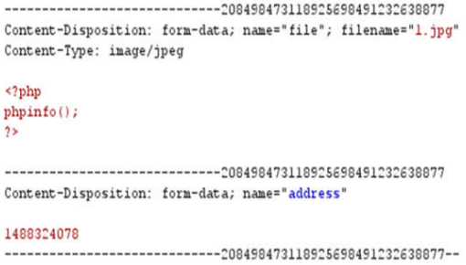

## 简答题

### 1. 现在非常多的Web程序没有正常的错误回显，这样就需要我们利用报错注入的方式来进行`SQL`注入，通过构造`payload`让信息通过错误提示回显出来，请简述3个`SQL`报错注入用到的函数，并简单解释其功能

答：

> 好像PPT上有相关的

1. **`updatexml()`函数**
   - `updatexml()`是一个使用不同的`xml`标记匹配和替换`xml`块的函数。
   - 作用：改变文档中符合条件的节点的值，`updatexml()`使用时，当`xpath_string`格式出现错误，`mysql`则会爆出`xpath`语法错误（`xpath syntax`）
2. **`extractvalue()`函数**
   - 此函数从目标XML中返回包含所查询值的字符串 
   - 作用：从`xml`类型的列中提取特定节点的值，`extractvalue()`使用时，当`xpath_string`格式出现错误，`mysql`则会爆出`xpath`语法错误（`xpath syntax`）
3. **`floor()`函数**
   - `floor()`函数是一个数学函数，用于向下取整
   - 作用：返回小于或等于给定数字的最大整数值。`floor()`使用时，主要利用其构造后语句整体使数据库查询报错，而不是让`mysql`爆出语法错误

### 2. 请简要叙述TCP ACK Ping主机扫描的特点

答：向目标主机的端口发送`ACK`包，如果收到`RST`包，说明该端口**没有被屏蔽**；没有收到`RST`包，说明**被屏蔽**。该方式只能用于确定防火墙是否屏蔽某个端口，可以辅助`TCP SYN`的方式来判断目标主机防火墙的状况。

### 3. 请简要叙述基于`DOM`的`XSS`的漏洞利用过程

答：

- **恶意输入注入：**攻击者通过输入框、`URL`参数等渠道将包含恶意脚本的输入数据提交到`Web`应用程序。
- **客户端`DOM`解析：**用户访问包含恶意输入的页面时，浏览器会解析`HTML`并构建`DOM`树。
- **`DOM`修改：**恶意脚本通过`JavaScript`脚本等方式对`DOM`进行修改。
- **脚本执行：**由于恶意脚本被插入到`DOM`中，浏览器在解析和执行`DOM`时会执行这些脚本，导致攻击成功。

## 分析题

### 1.请分析下面的代码，并回答问题：

```http
a) http://localhost/test.php?id=1' and 1=2 union select 1,2,database() -- xx
b) http://localhost/test.php?id=1' and 1=2 union select 1,2,TABLE_NAME from information_schema.TABLES where TABLE_SCHEMA=database() limit 1,1 -- ss
```

#### （1）语句`a`的作用是？

答：通过`UNION`查询语句获取当前数据库的名称

#### （2）语句`b`的作用是？

答：通过`UNION`查询，将结果与第一个查询返回的结果合并，并从`information_schema.TABLES`表中获取表名信息

#### （3）如果已知表名为`testable`，要获取字段`flag`的内容，应使用语句？

```mysql
http://localhost/test.php?id=-1' union select 1,2,group_concat(flag) from testable --+
```

### 2. 某网站的部分核心代码如下所示：

```php
……
<form action="" method="get">
    <input type="text" name="myinput">
    <input type="submit">
</form>
<hr><hr>
<?php
    header("Content-Type:text/html;charset=gb2312");
	$input="";
	@str_replace('<script>',"",$_GET['input']);
	echo '你输入的字符为<br>'.$input;
?>
……
```

请分析这段代码，回答以下问题

#### （1）这段代码可能存在什么类型的漏洞？

答：跨站脚本攻击（反射型`XSS`漏洞）

#### （2）请写出3条语句来验证该网站存在的漏洞

答：

1. 双写`script`标签进行绕过：`<sc<script>ript>alert(/xss/)</scipt>`
2. 大小写绕过：`<ScRipt>alert(/xss/)</ScRipt>`
3. 利用`img`标签绕过：``

### 3. 某网站服务器采用的`PHP`版本为5.6.0，存在`0x00`截断漏洞。代码中`address`变量是在`HTML`表单中获取的时间，值为`1400324078`，将会以时间给文件重命名。上传时`BurpSuite`抓到的数据包如下图所示



**请回答以下问题：**

#### （1）请详细叙述利用`0x00`截断漏洞的上传攻击过程

> 有个问题在于，这玩意究竟是改路径的00截断还是文件名的00截断

答：上传名为`1.jpg`的`php`文件，使用`BurpSuite`抓包，在保存路径后加上`1.php%00`，然后放包即可（如果是文件名的应该就把文件名弄成`1.php%00.jpg`，但是这个看着又不像）

#### （2）如果攻击成功，保存在服务器上的文件名是什么？

答：`1400324078.php`（应该吧）

#### 4. 请分析如下代码，回答问题：

```php
<?php
    if(isset($_POST['btnSign'])) 
    {
        $message = trim($_POST['mtxMessage']);
        $name = trim($_POST['txtName']);
        $message = strip_tags(addslashes($message));
        $message = ((isset($GLOBALS["___mysqli_ston"]) && is_object($GLOBALS["___mysqli_ston"])) ? mysqli_real_escape_string($GLOBALS["___mysqli_ston"], $message) : ((trigger_error("[MySQLConverterToo] Fix the mysql_escape_string() call! This code does not work.", E_USER_ERROR)) ? "" : ""));
        $message = htmlspecialchars($message);
        $name = str_replace('<script>', '', $name);
        $name = ((isset($GLOBALS["___mysqli_ston"]) && is_object($GLOBALS["___mysqli_ston"])) ? mysqli_real_escape_string($GLOBALS["___mysqli_ston"], $name) : ((trigger_error("[MySQLConverterToo] Fix the mysql_escape_string() call! This code does not work.", E_USER_ERROR)) ? "" : ""));
        $query = "INSERT INTO guestbook (comment, name) VALUES ('$message', '$name');";
        $result = mysqli_query($GLOBALS["___mysqli_ston"], $query) or die('<pre>'. ((is_object($GLOBALS["___mysqli_ston"])) ? mysqli_error($GLOBALS["___mysqli_ston"]) : (($___mysqli_res = mysqli_connect_error()) ? $__mysqli_res: false)). '</pre>');
    }
?>
```

#### （1）请分析这段代码存在什么漏洞？根据代码分析漏洞产生的原因是什么？

答：这段代码存在以下漏洞类型：

- **`SQL`注入：**尽管使用了`mysqli_real_escape_string`，但直接将用户输入插入到SQL查询中仍然存在风险
- **`XSS`（跨站脚本攻击）：**虽然对`$message`使用了`htmlspecialchars`，但对`$name`的处理不够全面，仅移除了`<script>`标签，仍然存在其他形式的XSS攻击

#### （2）请解释`trim()`，`mysqli_real_escape_string()`，`htmlspecialchars()`函数的作用

答：

- `trim()`: `trim()` 函数用于去除字符串首尾的空格或其他指定字符。这样可以确保用户输入的数据不包含不必要的空格，提高数据的一致性
- `mysqli_real_escape_string()`: `mysqli_real_escape_string()` 函数用于对字符串中的特殊字符进行转义，以防止`SQL`注入攻击。该函数会将**单引号**、**双引号**等特殊字符转义，使其在`SQL`查询中不被误解为语句的一部分
- `htmlspecialchars()`: `htmlspecialchars()` 函数用于将特殊字符转换为`HTML`实体，以防止跨站脚本攻击（`XSS`）。如，将 `<` 转换为 `<`，`>` 转换为 `>`，这样可以确保用户输入的数据不会被当作`HTML`或`JavaScript`代码执行

#### （3）请简单阐述这种攻击方式的防御措施

> 是我之前sb了，应该是SQL和XSS都有吧，不太确定了，都写上应该就不会有问题了

答：

- **`SQL`注入**
  - 使用**预处理语句（参数化语句）**而非动态`SQL`来组装`SQL`查询
  - 使用**`ORM`框架编程技术**，将关系数据库中的数据映射到应用程序中的对象
  -  **输入验证和清理**，对用户输入进行严格的验证和清理，确保数据符合预期格式
  - **错误处理**，避免直接输出数据库错误信息，改为输出通用的错误信息
- **`XSS`（跨站脚本攻击）**
  -  **对输出进行编码**，在输出到`HTML`页面时，对用户输入进行编码，防止恶意脚本执行
  - **输入验证和清理**，对用户输入进行验证和清理，移除或转义潜在的恶意代码
  - 使用**内容安全策略**，配置`CSP`头，限制浏览器执行或加载的资源，防止`XSS`攻击
  - 使用**安全的模板引擎**，它们默认会对输出进行编码
